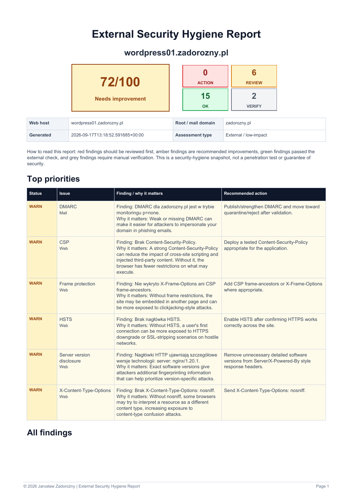

# Domain Security Scanner

**Version 1.1.0** - low-impact external security posture checks for domains you own or are explicitly authorized to assess.

> **Source-available / non-commercial license.** This project is free for personal, educational, research, evaluation, testing, and internal non-commercial use. Commercial use requires separate written permission from Jarosław Zadorożny. See [LICENSE](LICENSE).
>
> **Authorization required.** Do not scan systems you do not own or have explicit permission to assess.

The scanner takes a domain or subdomain, performs passive and low-impact external checks, and produces a customer-friendly **PDF report** plus structured **JSON** output. It intentionally does not exploit vulnerabilities, brute-force credentials, scan port ranges, perform denial-of-service tests, or attempt to access non-public data.

## Example report

The example below was generated against a maintainer-controlled WordPress test host.

[Open the full example PDF](docs/example-report.pdf)



## Highlights

- Exact web-target checks while registration and mail checks follow the registered/root domain
- Selectable scan groups for domain, discovery, mail, TLS, web, and CMS checks
- RDAP, DNSSEC, CAA, nameserver and expiry checks
- Certificate Transparency subdomain discovery through `crt.sh`
- DNS inventory with resolver-error awareness, live/historical hostname separation, and same-site crawling
- HTTPS/TLS certificate analysis and legacy TLS detection
- HTTP-to-HTTPS redirect and mixed-content checks
- Customer-facing HTTP security-header findings
- Session/auth cookie flag checks (`Secure`, `HttpOnly`, `SameSite`)
- SPF syntax, duplicate-record and recursive DNS lookup-budget analysis
- DMARC policy, syntax, reporting and alignment analysis
- DKIM common-selector checks with conservative `UNKNOWN` handling
- RFC 7505 Null MX detection and validation
- RFC 8461 MTA-STS indicator/policy validation and MX-pattern coverage
- RFC 8460 TLS-RPT policy and reporting-destination validation
- Passive CMS/platform fingerprinting and version discovery
- Live CMS release-currency checks for common CMS platforms
- Server/framework version-disclosure checks
- Scope-aware PDF findings with short "why it matters" explanations
- External Security Hygiene Score from 0 to 100 for the effective selected scan scope

## Requirements

- Python **3.11+** recommended
- Internet access for DNS/RDAP/CT lookups and selected upstream release checks
- Windows, Linux, or macOS

The PDF generator uses Unicode fonts already installed on the host OS. Font files are not bundled with this repository.

## Quick start

Clone the repository and create a virtual environment:

```bash
git clone https://github.com/zadorozny-jaroslaw/domain-security-scanner.git
cd domain-security-scanner
python -m venv .venv
```

Activate it:

**Windows PowerShell**

```powershell
.\.venv\Scripts\Activate.ps1
```

**Linux/macOS**

```bash
source .venv/bin/activate
```

Install dependencies:

```bash
python -m pip install --upgrade pip
python -m pip install -r requirements.txt
```

Check the installed project version:

```bash
python domain_security_scan.py --version
```

Run an authorized scan:

```bash
python domain_security_scan.py example.com --authorized
```

The default output is:

```text
security-report-example.com.pdf
security-report-example.com.json
```

## Usage

```text
python domain_security_scan.py DOMAIN --authorized [--scan GROUPS] [--skip GROUPS] [--max-pages N] [--max-hosts N] [--out PREFIX]
```

Examples:

```bash
# Default: run all six scan groups
python domain_security_scan.py shop.example.com --authorized

# Run only selected groups
python domain_security_scan.py example.com --authorized --scan mail,web

# Run the default full scan except selected groups
python domain_security_scan.py example.com --authorized --skip discovery,cms

# --skip wins when the same group appears in both lists
python domain_security_scan.py example.com --authorized --scan mail,web --skip mail

python domain_security_scan.py example.com --authorized --max-pages 15 --max-hosts 20
python domain_security_scan.py example.com --authorized --out customer-example
```

The `--authorized` flag is deliberately mandatory.

## Scan groups

The public scan groups are:

| Group | Main responsibility |
| --- | --- |
| `domain` | registered/root-domain posture: RDAP, expiry, registrar, nameservers, DNSSEC, CAA |
| `discovery` | external attack-surface discovery: Certificate Transparency, crawl, DNS inventory, live/historical host classification |
| `mail` | MX, SPF, DMARC, DKIM, MTA-STS, TLS-RPT |
| `tls` | HTTPS certificate, expiry, negotiated TLS/cipher, legacy TLS support |
| `web` | HTTP redirect, headers, cookies, mixed content, `security.txt`, server disclosure |
| `cms` | passive CMS/platform detection and release-currency checks |

With neither `--scan` nor `--skip`, all six groups run. `--scan` limits the effective scope to the listed groups. `--skip` removes listed groups from either the default full scope or a `--scan` selection. If both options are present, `--skip` always has higher priority. The CLI warns that the combination may be redundant and prints an additional warning naming any groups present in both lists.

Group names are comma-separated, case-insensitive, and deduplicated. There are currently **no aliases** such as `all` or `infra`; only the six names above are accepted.

Some groups need prerequisite context owned by another group. The orchestrator may collect that context silently without enabling the prerequisite group's findings or score contribution. In particular:

- `domain`, `discovery`, and `mail` share registered/root-domain context from RDAP;
- `web` and `cms` share a single HTTPS-homepage context fetch;
- `cms` alone can reuse the HTTPS response without running Web findings.

The effective scope is recorded in JSON as `scan_groups`, while `scan_selection` preserves requested/skip/overlap metadata and CLI selection warnings. The PDF shows the effective scope and hides technical sections for groups that were not selected.

See [docs/SCAN_GROUPS.md](docs/SCAN_GROUPS.md) for the orchestration and prerequisite model.

## Web target vs registered/root domain

The command-line value is treated as the **exact web target**. For example, if you scan:

```text
app.eu.example.com
```

HTTP, HTTPS, TLS, cookie, mixed-content and web-platform checks stay on that host.

The scanner then walks RDAP upward to identify the registered/root domain (for example `example.com`) when selected groups need that context. Registration, expiry, nameserver, DNSSEC and mail-security checks use that root domain as appropriate. If RDAP is unavailable, a conservative fallback is used.

This avoids treating a website subdomain as if it were the organization's mail domain.

## What it checks

### Domain and DNS

- RDAP root-domain discovery
- registrar and nameservers
- domain-expiry visibility
- transfer-prohibited status where externally visible
- DNSSEC indication (`DS` / RDAP)
- CAA
- `A`, `AAAA`, `CNAME`, `MX`, `TXT`, `NS`, `CAA`, and selected `DS` records
- passive Certificate Transparency hostname discovery

Discovered hosts are grouped in reports as **current DNS**, **historical CT**, **currently unresolved**, **DNS status unknown**, or **not DNS-assessed**. Historical classification is conservative: a CT-discovered name is only labelled historical when current DNS returns NXDOMAIN. The existing `subdomains` JSON list remains the complete discovered-name list, while the additive `host_inventory` object provides these clearer groups.

### Mail posture

- MX, including RFC 7505 Null MX semantics
- SPF presence and policy
- duplicate SPF records
- practical SPF syntax validation
- recursive SPF DNS lookup-budget estimate against the 10-term limit
- DMARC syntax and policy (`p`, `sp`, `pct`)
- DMARC aggregate reporting (`rua`)
- DKIM/SPF alignment modes (`adkim`, `aspf`)
- common-selector DKIM discovery (absence is not treated as proof that DKIM is missing)
- MTA-STS (RFC 8461 TXT indicator, HTTPS policy syntax, mode and MX coverage)
- TLS-RPT (RFC 8460 policy syntax and `rua` reporting destinations)

### Web and TLS

- HTTPS and certificate validity/expiry
- negotiated TLS protocol and cipher
- TLS 1.0 / 1.1 legacy-protocol checks
- HTTP-to-HTTPS redirect
- mixed HTTP content on HTTPS pages
- sensitive/session cookie flags
- HSTS
- Content-Security-Policy
- X-Content-Type-Options
- Referrer-Policy
- Permissions-Policy
- frame/clickjacking protection
- `security.txt`
- server/framework version disclosure

### CMS/platform

Passive detection currently includes common signals for:

- WordPress
- Drupal
- Joomla
- Ghost
- TYPO3
- Shopify
- Wix
- Squarespace
- Webflow

The scanner does **not** probe `/wp-admin`, `/readme.html`, plugin directories, login pages, or CMS-specific enumeration endpoints merely to identify a platform.

When a high-confidence version is publicly disclosed, supported CMSes can be compared with current upstream release information. A newer release is a **review/update** finding, not automatic proof of a vulnerability.

## Report statuses

| Status | Meaning |
| --- | --- |
| 🟢 `OK` | Healthy/current for the check performed |
| 🟡 `REVIEW` | Hardening or update recommended |
| 🔴 `ACTION` | Failure or higher-priority issue requiring review |
| 🔵 `INFO` | Informational finding |
| ⚪ `VERIFY` | Cannot be established reliably from the external scan |

WARN and FAIL findings include a short **Why it matters** explanation. The wording describes exposure or hardening value without claiming that compromise has occurred.

## Scoring

The score is intentionally named **External Security Hygiene Score**, not a general "security score."

Only applicable weighted checks from the **effective selected scan groups** contribute to the denominator. Findings produced only as prerequisite context for an unselected group are suppressed and cannot affect the score. Unknown/unverifiable checks are excluded rather than penalized. DNS timeouts, SERVFAIL responses and resolver errors are treated as unavailable evidence rather than as proof that a record is absent. Several useful findings - including CMS release currency - are informational or advisory and intentionally have no score weight.

Scores from different scan scopes are not directly comparable. For example, a Web-only score intentionally excludes positive and negative TLS, Mail, Domain, Discovery, and CMS findings that would participate in a full scan.

See [docs/SCORING.md](docs/SCORING.md) for the scoring philosophy.

## External services and privacy

The scanner talks to the target and to a small number of public infrastructure/release services, including RDAP sources, `crt.sh`, and upstream CMS release sources. No API keys are required for the default checks.

Selected scan groups control which checks run, although prerequisite context may require a limited request owned by another group. Before using the scanner in a privacy-sensitive environment, read [docs/DATA_SOURCES.md](docs/DATA_SOURCES.md), which documents what is queried externally.

## Safety and scope

This project is designed as an **external posture / hygiene check**, not a penetration-testing framework.

The default project scope intentionally excludes:

- vulnerability exploitation
- credential attacks or brute force
- broad port scanning
- DoS/load testing
- accessing non-public data
- authenticated tenant or endpoint assessment
- automatic claims that a detected software version is vulnerable

See [docs/SCOPE.md](docs/SCOPE.md).

## Limitations

- This is not a penetration test or a guarantee of security.
- External observation cannot assess MFA, backups, endpoint protection, internal permissions, offboarding, or tenant configuration.
- DKIM cannot always be discovered without knowing the selector.
- DNSSEC presence is detected, but the scanner does not perform full cryptographic chain validation.
- `.pl` Registry Lock may require manual verification at the registrar.
- Certificate Transparency is historical by design; the report separates CT names that now return NXDOMAIN from hosts with current DNS records, while resolver failures remain explicitly unknown.
- SPF lookup count is a static worst-case estimate; macros and runtime DNS behavior can affect exact evaluation.
- Cookie analysis is limited to cookies externally visible during the unauthenticated crawl/redirect chain.
- Legacy TLS results depend partly on what the local TLS library can test; uncertain cases are reported as `VERIFY`.
- Passive CMS detection can miss intentionally hidden or heavily proxied platforms.
- Partial-scope scores summarize only the selected groups and should not be interpreted as equivalent to a full-scan score.

See [`docs/STANDARDS.md`](docs/STANDARDS.md) for the RFC/standards registry and the exact standards-backed checks implemented by the scanner.

## Project structure

The scanner is organized as a Python package while keeping `domain_security_scan.py` as the command-line entry point. The six functional scan groups live under `domain_security_scanner/domains/`; selection policy and prerequisite ordering are centralized in `orchestration.py`.

```text
domain_security_scan.py              # CLI entry point
domain_security_scanner/
├── __init__.py                       # public package API
├── version.py                        # scanner version
├── constants.py                      # shared scanner constants
├── models.py                         # typed check/status/category/score result models
├── utils.py                          # domain/date helper functions
├── base.py                           # shared Scanner state
├── orchestration.py                  # scan-group order, selection, prerequisites, execution plan
├── scanner.py                        # Scanner composition, execution, scoring, serialization
├── cli.py                            # argument parsing and output handling
├── domains/
│   ├── domain/                       # RDAP and authoritative/root DNS posture
│   ├── discovery/                    # CT discovery, crawl, DNS host inventory
│   ├── mail/                         # MX/SPF/DMARC/DKIM/MTA-STS/TLS-RPT
│   ├── tls/                          # certificate and TLS protocol checks
│   ├── web/                          # HTTP, headers, cookies, mixed content, security.txt
│   └── cms/                          # passive CMS detection and release currency
├── standards/
│   ├── __init__.py                   # standards package exports
│   ├── registry.py                   # RFC metadata/reference registry
│   └── mail.py                       # mail-standard parsing/validation helpers
└── reporting/
    ├── __init__.py
    └── pdf.py                        # scope-aware PDF rendering
```

This layout isolates functional checks from orchestration and reporting. `domain_security_scanner.orchestration` defines the canonical public group order and prerequisite execution plan, while `Scanner` composes the group mixins and suppresses findings owned by unselected prerequisite groups.

See [docs/SCAN_GROUPS.md](docs/SCAN_GROUPS.md) for the detailed architecture.

## Contributing

Contributions are welcome when they preserve the project's low-impact, evidence-based posture-check scope.

Development work normally starts from `develop`, returns to `develop` through a focused pull request, and is promoted to `main` only through a release pull request. See [docs/DEVELOPMENT_WORKFLOW.md](docs/DEVELOPMENT_WORKFLOW.md) for the branch and release workflow.

Before opening a large pull request, read [CONTRIBUTING.md](CONTRIBUTING.md). In particular, new findings should minimize false positives, explain why they matter, and avoid turning the default scanner into an exploitation framework.

## Security issues in this project

Please do **not** publish scanner vulnerabilities, secrets, customer reports, or sensitive target details in a public issue. Follow [SECURITY.md](SECURITY.md).

## Releases and versioning

The project uses semantic versioning:

- `1.0.x` - compatible bug fixes
- `1.x.0` - compatible new checks/features
- `2.0.0` - breaking behavior or interface changes

See [CHANGELOG.md](CHANGELOG.md), [docs/RELEASE_CHECKLIST.md](docs/RELEASE_CHECKLIST.md), and [docs/DEVELOPMENT_WORKFLOW.md](docs/DEVELOPMENT_WORKFLOW.md).

## License

Copyright © 2026 **Jarosław Zadorożny**.

This repository uses a **custom non-commercial source-available license**. It is not an OSI-approved open-source license because commercial use is restricted.

Personal, educational, academic, research, evaluation, testing, and internal non-commercial use are permitted under the terms in [LICENSE](LICENSE). Paid scans, consulting, managed services, SaaS, resale, or other commercial use require separate written permission from Jarosław Zadorożny.
